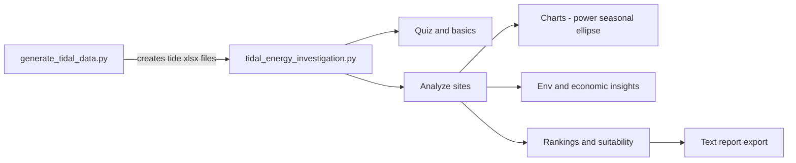

# 🌊 Tidal Energy Investigation — Run It FREE on Google Colab (or Locally)

> Turn learners into **Tidal Energy Detectives**. This project generates realistic (synthetic) tidal datasets for Ireland and guides a **gamified** investigation of tidal power — including spring/neap cycles, flood/ebb asymmetry, environmental benefits, economics, charts, and a final report.
>
> Built for Youth Academy sessions, STEM outreach, and curious minds who want to see **v³** (velocity cubed) drive tidal power — predictably.


[](https://colab.research.google.com)

---

## 📚 Table of Contents

* [Overview](#overview)
* [Folder & Files](#folder--files)
* [🚀 Quickstart (Google Colab — Free, No Setup)](#-quickstart-google-colab--free-no-setup)
* [🧪 Local Setup (Optional)](#-local-setup-optional)
* [Outputs You’ll Get](#outputs-youll-get)
* [How It Works (Plain English)](#how-it-works-plain-english)
* [🎮 Gameplay Flow](#-gameplay-flow)
* [🎛 Customize / Tweak](#-customize--tweak)
* [🧩 Troubleshooting (Colab & Local)](#-troubleshooting-colab--local)
* [❓ FAQ](#-faq)
* [🤝 Contributing](#-contributing)
* [📜 License](#-license)
* [📦 requirements.txt](#-requirementstxt)

---

## Overview

This folder contains two scripts for a hands-on tidal power investigation:

1. **`generate_tidal_data.py`** — Creates monthly **2024** tidal datasets (`.xlsx`) for the **Shannon Estuary** (baseline) and 8 strategic Irish sites:

   * Strangford Lough (Northeast)
   * Cork Harbour Entrance (South)
   * Tuskar Rock Channel (Southeast)
   * Saltee Sound (Southeast)
   * Bulls Mouth (Southwest)
   * Blasket Sound (Southwest)
   * Gregory Sound (West)
   * Rathlin Sound (North)

   Each dataset includes:

   * **Mean Tidal Range (m)**, **Spring Tide Range (m)**, **Neap Tide Range (m)**
   * **Peak Current Velocity (m/s)** plus **Flood/Ebb** velocities

2. **`tidal_energy_investigation.py`** — An **interactive terminal game** that turns learners into *Tidal Energy Detectives*:

   * Short **quiz** on tidal physics & lunar cycles 🧠
   * Analyze chosen or random sites from the generated Excel files
   * Auto-create **power plots**, **spring vs neap** charts, **tidal ellipse** (flood/ebb)
   * Explore **environmental** (CO₂ savings, predictability benefits) & **economic** (costs, jobs, payback, LCOE) factors
   * Export a **professional text report** with rankings & recommendations

> ⚠️ **Educational Note**: Numbers are illustrative for learning. Real projects require multi-year current measurements, detailed bathymetry, ecological studies, grid connection analysis, and robust finance models.

---

## Folder & Files

```
Wave Energy Investigation/
├── generate_tidal_data.py
├── tidal_energy_investigation.py
└── (created at runtime)
    ├── Shannon_Estuary_Tide_2024.xlsx
    ├── *_Tide_2024.xlsx
    ├── *_tidal_power_analysis.png
    ├── *_tidal_resource_analysis.png
    ├── *_tidal_ellipse.png
    └── Tidal_Detective_Report_<Your_Name>.txt
```

---

## 🚀 Quickstart (Google Colab — Free, No Setup)

Run everything in **Google Colab** with zero local installs.

1. Open **[https://colab.research.google.com](https://colab.research.google.com)** → **New Notebook**
2. **Install dependencies** in the first cell:

   ```python
   !pip install -q pandas numpy matplotlib openpyxl
   ```
3. **Upload the two scripts** from this folder:

   ```python
   from google.colab import files
   uploaded = files.upload()  # choose: generate_tidal_data.py, tidal_energy_investigation.py
   ```
4. **Generate the datasets** (Excel files):

   ```python
   !python generate_tidal_data.py
   ```
5. **Run the interactive game** (use `-u` for unbuffered I/O so prompts appear instantly):

   ```python
   !python -u tidal_energy_investigation.py
   ```
6. **(Optional) Save outputs to Google Drive**:

   ```python
   from google.colab import drive
   drive.mount('/content/drive')
   !mkdir -p /content/drive/MyDrive/tidal_outputs
   !cp -n *.xlsx *.png *.txt /content/drive/MyDrive/tidal_outputs/ 2>/dev/null || true
   ```
7. **(Optional) Download outputs to your computer**:

   ```python
   import glob
   from google.colab import files
   for f in glob.glob('*.xlsx') + glob.glob('*.png') + glob.glob('*.txt'):
       files.download(f)
   ```

> 💡 **Tip**: If input prompts seem stuck, re-run step 5. `-u` (unbuffered) keeps I/O flowing in Colab.

---

## 🧪 Local Setup (Optional)

Prefer running locally? From your repo root:

```bash
# (optional) create & activate a virtual environment
python -m venv .venv
# Windows
.venv\Scripts\activate
# macOS / Linux
source .venv/bin/activate

# install dependencies
pip install pandas numpy matplotlib openpyxl

# go to the project folder & run
cd "Wave Energy Investigation"
python generate_tidal_data.py
python tidal_energy_investigation.py
```

---

## Outputs You’ll Get

* **Excel datasets**
  `Shannon_Estuary_Tide_2024.xlsx`, `Strangford_Lough_Northeast_Tide_2024.xlsx`, …

* **Charts (per analyzed location)**

  * `<Location>_tidal_power_analysis.png` — monthly **kW** estimate + resource overlay
  * `<Location>_tidal_resource_analysis.png` — **spring vs neap** comparison
  * `<Location>_tidal_ellipse.png` — **flood/ebb** pattern & asymmetry

* **Final report (optional)**
  `Tidal_Detective_Report_<Your_Name>.txt` — executive summary, rankings by **v³**, recommendations, and per-site details.

---

## How It Works (Plain English)

* **Tidal power scales with velocity cubed** → `P ∝ v^3`
* Teaching-friendly **power estimate** used for visuals (scaled to a nominal turbine area).
* **Commercial rule-of-thumb**: sites need peak currents **> 2 m/s**.
* The game estimates annual energy for a **10 MW** farm with typical capacity factors and hours/year.



> **Reminder:** Real-world projects require multi-year measurements, spectral/directional flow characterization, extreme conditions & survivability, grid studies, ecology, permitting, and finance.

---

## 🎮 Gameplay Flow

1. **Tutorial** → mini **quiz** (score points)
2. Choose **3–8** sites (manual or random)
3. For each site:

   * Summary: **range**, **v**, **v³ score**, **kW**, **MWh**, **homes powered**
   * ASCII mini-bars per month (range & speed)
   * Pick an **advanced analysis**:

     1. Spring/Neap analysis
     2. Flood/Ebb tidal ellipse
     3. Environmental impact
     4. Economic feasibility (10 MW)
     5. Continue
   * Charts are saved automatically
4. **Site selection mini-game** → more points
5. Final **rank** → optional **report** export

---

## 🎛 Customize / Tweak

**In `tidal_energy_investigation.py`:**

* Turbine sizing & layout in the annual energy assumptions (10 MW default)
* Economic inputs (price, CAPEX/OPEX, jobs) in `calculate_economic_factors`
* Plot styles and color palettes in the chart helpers
* Tidal ellipse directions/text if you want local orientation

**In `generate_tidal_data.py`:**

* Baseline Shannon Estuary monthly values
* Location **range** & **velocity** factors (bathymetry, channeling)
* Spring/neap ratio and random variation bands

---

## 🧩 Troubleshooting (Colab & Local)

* **“No tidal data files found!”**
  Run `python generate_tidal_data.py` first — the game looks for `*_Tide_2024.xlsx` in the **current working directory**.

* **Colab can’t see my files**
  Re-run the `files.upload()` cell or clone your repo into Colab:

  ```python
  !git clone https://github.com/<your-username>/<your-repo>.git
  %cd "<your-repo>/Wave Energy Investigation"
  ```

* **Excel read/write error**
  Ensure `openpyxl` is installed:

  ```bash
  pip install openpyxl
  ```

* **Charts don’t appear inline**
  Expected — the game **saves** charts as `.png` files in the working folder.

* **Emoji/UTF‑8 issues**
  If your terminal can’t render emojis, everything still runs fine.

---

## ❓ FAQ

**Q: Do I need a GPU or paid Colab?**
A: No. CPU runtime is plenty.

**Q: Can I analyze fewer sites?**
A: Yes, choose 3–8 during gameplay.

**Q: Can I export CSV instead of Excel?**
A: Absolutely — tweak the generator to also call `DataFrame.to_csv(...)`.

**Q: Are these numbers suitable for finance decisions?**
A: They’re **educational**. For real projects, add multi-year measurements, detailed hydrodynamics, survivability, grid, ecology, and proper LCOE analysis.

---

## 🤝 Contributing

Ideas & improvements welcome! Great first issues:

* CLI flags (e.g., `--random N`, `--report`)
* CSV export for monthly power
* Uncertainty bands & multi-year variability
* Hooks for real bathymetry and constraints

Please open a PR with a short description, screenshots of new charts (if applicable), and notes on any new dependencies.

---

## 📦 requirements.txt

```txt
pandas
numpy
matplotlib
openpyxl
```

---

**Happy investigating — may your channels be narrow, your currents fast, and your planning windows slack!** 🌊🔎⚡
