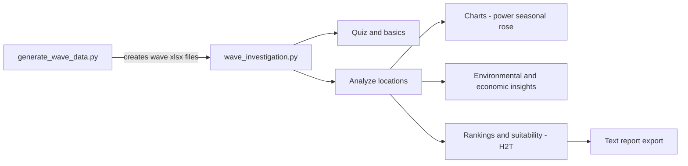

# 🌊 Wave Energy Investigation — Run It FREE on Google Colab (or Locally)

> Turn learners into **Wave Energy Detectives**. Generate realistic (synthetic) wave‑climate datasets for Ireland, then guide a **gamified** investigation of wave power, seasonality, directionality, environmental impact, and basic economics — all from the terminal.
>
> Built for Youth Academy sessions, STEM outreach, and curious minds who want to see **H²T (height² × period)** come alive.


[](https://colab.research.google.com)

---

## 📚 Table of Contents

* [Overview](#overview)
* [Folder & Files](#folder--files)
* [🚀 Quickstart (Google Colab — Free, No Setup)](#-quickstart-google-colab--free-no-setup)
* [🧪 Local Setup (Optional)](#-local-setup-optional)
* [Outputs You’ll Get](#outputs-youll-get)
* [How It Works (Plain English)](#how-it-works-plain-english)
* [🎮 Gameplay Flow](#-gameplay-flow)
* [🎛 Customize / Tweak](#-customize--tweak)
* [🧩 Troubleshooting (Colab & Local)](#-troubleshooting-colab--local)
* [❓ FAQ](#-faq)
* [🤝 Contributing](#-contributing)
* [📜 License](#-license)
* [📦 requirements.txt](#-requirementstxt)

---

## Overview

**Wave Energy Investigation** consists of two scripts inside the `Wave Energy Investigation/` folder:

1. **`generate_wave_data.py`** — Creates monthly **2024** wave‑climate spreadsheets (`.xlsx`) for eight Irish sites plus a Loop Head baseline. Each file contains:

   * **Significant Wave Height (m)**
   * **Average Wave Period (s)**

   Data are **synthetic but realistic**: winter months are stormier; summer is calmer.

2. **`wave_investigation.py`** — An **interactive terminal game** that turns learners into *Wave Energy Detectives*:

   * Short **quiz** on wave physics 🧠
   * Analyze chosen or random sites from the generated Excel files
   * Auto‑create **power plots**, **seasonal charts**, **wave roses**
   * Explore **environmental** (CO₂ savings, reef habitat) & **economic** (costs, jobs, payback) factors
   * Export a **professional text report** with rankings and recommendations

> ⚠️ **Educational Note**: Outputs are indicative for learning. Real projects require multi‑year spectra, directional distributions, extreme/survivability analysis, grid studies, ecology, finance, etc.

---

## Folder & Files

```
Wave Energy Investigation/
├── generate_wave_data.py
├── wave_investigation.py
└── (created at runtime)
    ├── *_Wave_2024.xlsx
    ├── *_wave_power_analysis.png
    ├── *_seasonal_wave_analysis.png
    ├── *_wave_rose.png
    └── Wave_Detective_Report_<Your_Name>.txt
```

---

## 🚀 Quickstart (Google Colab — Free, No Setup)

You can run **everything** in **Google Colab** without installing anything locally.

1. Open **[https://colab.research.google.com](https://colab.research.google.com)** → **New Notebook**
2. **Install dependencies** in the first cell:

   ```python
   !pip install -q pandas numpy matplotlib openpyxl
   ```
3. **Upload the two scripts** from this folder:

   ```python
   from google.colab import files
   uploaded = files.upload()  # choose: generate_wave_data.py, wave_investigation.py
   ```
4. **Generate the datasets** (Excel files):

   ```python
   !python generate_wave_data.py
   ```
5. **Run the interactive game** (use `-u` for unbuffered I/O so prompts appear instantly):

   ```python
   !python -u wave_investigation.py
   ```
6. **(Optional) Save outputs to Google Drive**:

   ```python
   from google.colab import drive
   drive.mount('/content/drive')
   !mkdir -p /content/drive/MyDrive/wave_outputs
   !cp -n *.xlsx *.png *.txt /content/drive/MyDrive/wave_outputs/ 2>/dev/null || true
   ```
7. **(Optional) Download outputs to your computer**:

   ```python
   import glob
   from google.colab import files
   for f in glob.glob('*.xlsx') + glob.glob('*.png') + glob.glob('*.txt'):
       files.download(f)
   ```

> 💡 **Tip**: If input prompts ever look stuck, just re‑run step 5. Colab handles `input()` fine with `-u` (unbuffered) mode.

---

## 🧪 Local Setup (Optional)

Prefer running on your own machine? From your repo root:

```bash
# (optional) create & activate a virtual environment
python -m venv .venv
# Windows
.venv\Scripts\activate
# macOS / Linux
source .venv/bin/activate

# install dependencies
pip install pandas numpy matplotlib openpyxl

# go to the project folder & run
cd "Wave Energy Investigation"
python generate_wave_data.py
python wave_investigation.py
```

---

## Outputs You’ll Get

* **Excel datasets**
  `Belmullet_Northwest_Wave_2024.xlsx`, `Aran_Islands_Wave_2024.xlsx`, …
  `Loop_Head_Wave_2024.xlsx` *(baseline)*

* **Charts (per analyzed location)**

  * `<Location>_wave_power_analysis.png` — monthly **kW/m** + climate overlay
  * `<Location>_seasonal_wave_analysis.png` — storm vs calm seasons
  * `<Location>_wave_rose.png` — directional climate (N, NE, …)

* **Final report (optional)**
  `Wave_Detective_Report_<Your_Name>.txt` — executive summary, **H²T** rankings, recommendations, and per‑site details.

---

## How It Works (Plain English)

* **Wave power scales with height² and period** → `P ∝ H² × T`
* The game uses a teaching‑friendly approximation for **power density**:
  `P ≈ 0.49 × H² × T` *(kW per meter of wave crest)*
* A quick site suitability index **H²T** is used with a classroom threshold of **H²T > 20**.
* Energy estimate combines average power, a nominal device width (30 m), hours/year, and a capacity factor.



> 🧭 **Reminder**: Real‑world assessments need multi‑year data, spectral/ directional details, extremes & survivability checks, grid connections, ecology, permitting, and finance.

---

## 🎮 Gameplay Flow

1. **Tutorial** → mini **quiz** (score points)
2. Choose **3–8** locations (manual or random)
3. For each location:

   * Summary: **H**, **T**, **H²T**, **kW/m**, **MWh**, **homes powered**
   * ASCII mini‑bars by month
   * Pick an **advanced analysis**:

     1. Seasonal patterns
     2. Wave direction (rose)
     3. Environmental impact
     4. Economic feasibility (30 MW)
     5. Continue
   * Charts saved automatically
4. **Device selection mini‑game** → extra points
5. Final **rank** → optional **report** export

---

## 🎛 Customize / Tweak

**In `wave_investigation.py`:**

* `device_width = 30` *(m of wave crest)*
* `capacity_factor = 0.35`
* Energy price, CAPEX/OPEX, jobs in `calculate_economic_factors`
* Seasonal buckets & color palettes in plotting helpers
* Directional weights in `create_wave_rose` (tuned for Irish coasts)

**In `generate_wave_data.py`:**

* Loop Head baseline monthly **H/T**
* Location **height/period factors** (exposure, bathymetry)
* Random variation bands *(±15% for H, ±10% for T)*

---

## 🧩 Troubleshooting (Colab & Local)

* **“No wave data files found!”**
  Run `python generate_wave_data.py` first — the game looks for `*_Wave_2024.xlsx` in the **current working directory**.

* **Colab can’t see my files**
  Re‑run the `files.upload()` cell or clone your repo into Colab:

  ```python
  !git clone https://github.com/<your-username>/<your-repo>.git
  %cd "<your-repo>/Wave Energy Investigation"
  ```

* **Excel read/write error**
  Ensure `openpyxl` is installed: `pip install openpyxl`

* **Charts don’t appear inline**
  That’s expected — the game **saves** charts as `.png` files in the working folder.

* **Emoji/UTF‑8 issues**
  If your terminal can’t render emojis, everything still runs fine.

---

## ❓ FAQ

**Q: Do I need a GPU or paid Colab?**
A: Nope. CPU runtime is plenty.

**Q: Can I analyze fewer sites?**
A: Yes. Choose 3–8 during gameplay.

**Q: Can I export CSV instead of Excel?**
A: Absolutely — tweak `generate_wave_data.py` to call `DataFrame.to_csv(...)` as well.

**Q: Are the numbers realistic for project finance?**
A: They’re **educational**. For real projects, augment with multi‑year hindcasts, spectra, survivability, grid, ecology, and proper LCOE analysis.

---

## 🤝 Contributing

Ideas & improvements welcome! Great first issues:

* CLI flags (e.g., `--random N`, `--report`)
* CSV export for monthly power
* Uncertainty bands & multi‑year variability
* Hooks for real station metadata (bathymetry, grid distance, constraints)

Please open a PR with a brief description, screenshots of new charts (if applicable), and notes on any new dependencies.

---


## 📦 requirements.txt

```txt
pandas
numpy
matplotlib
openpyxl
```

---

**Happy investigating — may your waves be tall, your periods long, and your devices storm‑proof!** 🌊🔎⚡
